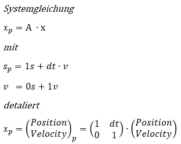
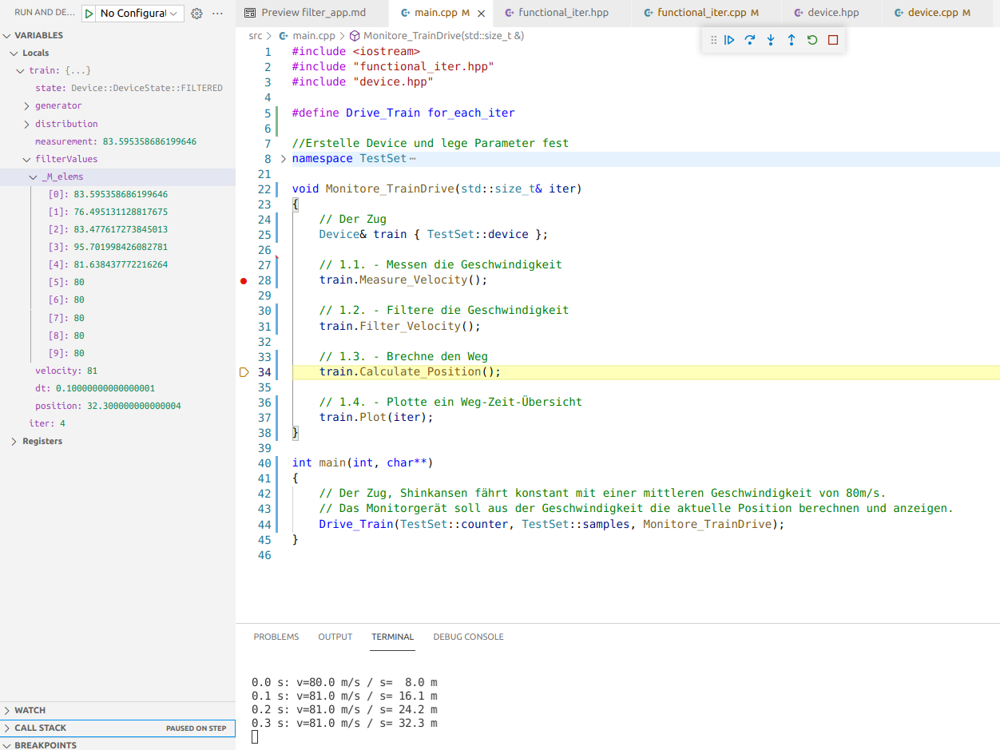
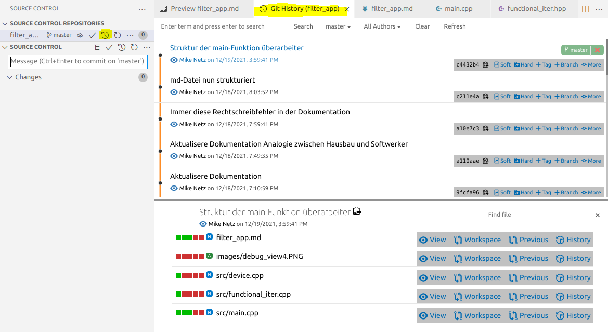

# Den Weg eines Fahrzeugs aus seiner Geschwindigkeit ermitteln

## 1. Blockschaltbild des Geräts

<br>

<!--  -->
  

<br>
<br>

## 2. Entwicklungsschritte

Entwicklungsschritte sind:
-	2.1. Formuliere die Idee mittels Blockschaltbild (BSB)
-	2.2. Erstelle ein C++-Projekt in Visual Studio Code
-	2.3. Schreibe die einzelnen [Arbeitsschritte](#link3) des BSD auf
-   2.4. Deklariere die [Schnittstelle](#link4)
-   2.5. Definiere die [Funktionsrümpfe](#link5) und rufe die Schnittstelle auf
-   2.6. Definiere alle [Funktionen](#link6)
-   2.7. Definiere zu jeder Funktion ein Unit-Test
-	2.8. Dokumentation (Dateien und md-Datei) abschließen

<br>
<br>

### <span id="link3">2.3. Schreibe die einzelnen Arbeitsschritte des BSD auf</span>

*Wie bei einem Hausbau zeichnet zuerst ein Architekt das Haus. Der Softwerker pinselt ein Blockschaltbild seiner Idee.*

Schreibe den Ablauf des Blockschaltbilds in kommentarform auf:
-   Definere das Testset. 
    -   Ein Zug fährt mit konstanter Geschwindigkeit.
    -   Ein Messgerät misst die Geschwindigkeit und ermittelt daraus die aktuelle Position. 
-   Die Messung soll 10s mit einer Auflösung von 100ms dauern.
-   Für die Iteration der Abtaswerte soll die "for_each_iter"-Funktion verwendet werden.
    -   Ach, die existiert noch garnicht. Kommt später. :smiley:


Datei main.cpp:
```C++
//...

//Erstelle Device und lege Parameter fest
namespace TestSet
{
    // Testgerät
    constexpr double speed_mean { 80.0 };  // m/s
    constexpr double speed_stddev { 8.0 }; // m/s
    constexpr double dt { 0.1 };    // 100ms
    // the device object
    
    // Testlauf
    constexpr double time { 10.0 }; // 10s
    constexpr std::size_t samples { static_cast<uint32_t>(time / dt) };
    std::size_t counter { 0 };
}

void Monitor_TrainDrive(std::size_t& iter)
{
    // 1.1. - Messen die Geschwindigkeit

    // 1.2. - Filtere die Geschwindigkeit

    // 1.3. - Brechne den Weg

    // 1.4. - Plotte ein Weg-Zeit-Übersicht
}

int main(int, char**)
{
    // Der Zug, Shinkansen fährt konstant mit einer mittleren Geschwindigkeit von 80m/s.
    // Das Monitorgerät soll aus der Geschwindigkeit die aktuelle Position berechnen und anzeigen.
}

// ...
```

<br>

### <span id="link4">2.4. Deklare die Schnittstelle</span>

*Nun erfolgt der Rohbau. Der Softwerker deklariert die Schnistelle durch Funktionen.*

Datei functional_iter.hpp:

```C++
// ...

// Berechne über für jede Iteration
void for_each_iter(std::size_t& iter, const size_t size, std::function<void(void)> fn);
void for_each_iter(std::size_t& iter, const size_t size, std::function<void(std::size_t&)> fn);

// ...
```
<br>

Datei device.hpp:

```C++
// ...

class Device final
{
public:
    using filter_array = std::array<double,10>;

    enum struct DeviceState
    {
        UNDEFINED,
        INITILIZED,
        MEASURED,
        FILTERED,
        CALCULATED,
        PLOTTED
    };

    // Initialisiere das Gerät
    Device(double speed_mean, double speed_stddev, double dt);

    // Messen die Geschwindigkeit
    double Measure_Velocity();

    // Filtere die Geschwindigkeit
    double Filter_Velocity();

    // Brechne den Weg
    double Calculate_Position();

    // Plotte ein Weg-Zeit-Deiagramm
    void Plot(std::size_t& iter);

private:
    Device() = delete;

    DeviceState _state { DeviceState::UNDEFINED };
};

// ....
```

<br>

### <span id="link5">2.5. Definiere die Funktionsrümpfe und rufe die Schnittstelle auf</span>

*Der Rohbau schreitet voran. Der Softwerker definiert die Schnittstellen-Funtionen durch Funktionsrümpfe.
Jede Funktion setzt einen Zustand. Die Funktionen werden in der "Main"-Funktion geordnet aufgerufen*

*Nun wird der Rohbau abgenommen. Der Softwerker testet den korrekten Aufruf der Schnittstelle mittels der Zustände im Debugger*

Datei device.cpp:

```C++
// ...

Device::Device(double speed_mean, double speed_stddev, double dt)
{
    _state = DeviceState::INITILIZED;
}


double Device::Measure_Velocity()
{
    _state = DeviceState::MEASURED;

    return 1.0;
}


double Device::Filter_Velocity()
{
    _state = DeviceState::FILTERED;

    return 2.0;
}


double Device::Calculate_Position()
{
    _state = DeviceState::CALCULATED;

    return 3.0;
}


void Device::Plot()
{
    _state = DeviceState::PLOTTED;
}

// ....
```
<br>

Datei main.cpp:

```C++
// ....

#define Drive_Train for_each_iter

//Erstelle Device und lege Parameter fest
namespace TestSet
{
    // Testgerät
    constexpr double speed_mean { 80.0 };  // m/s
    constexpr double speed_stddev { 8.0 }; // m/s
    constexpr double dt { 0.1 };    // 100ms
    Device device {speed_mean, speed_stddev, dt};
    
    // Testlauf
    constexpr double time { 10.0 }; // 10s
    constexpr std::size_t samples { static_cast<uint32_t>(time / dt) };
    std::size_t counter { 0 };
}


void Monitor_TrainDrive(std::size_t& iter)
{
    // Der Zug
    Device& train { TestSet::device };

    // 1.1. - Messen die Geschwindigkeit
    train.Measure_Velocity();

    // 1.2. - Filtere die Geschwindigkeit
    train.Filter_Velocity();

    // 1.3. - Brechne den Weg
    train.Calculate_Position();

    // 1.4. - Plotte ein Weg-Zeit-Übersicht
    train.Plot(iter);
}

int main(int, char**)
{
    // Der Zug, Shinkansen fährt konstant mit einer mittleren Geschwindigkeit von 80m/s.
    // Das Monitorgerät soll aus der Geschwindigkeit die aktuelle Position berechnen und anzeigen.
    Drive_Train(TestSet::counter, TestSet::samples, Monitor_TrainDrive);
}

// ...
```
<br>

### <span id="link6">2.6. Definiere alle Funktionen</span>

*Beim Innausbau erstellt jedes Gewerk seine Einrichungen, der Rohrleger verlegt die Fussbodenheizung, der Elektriker die Kabel. 
Analog impementiert der Softwerker seine Funktionen*

Die Implementierung erfolt in kompakter funktionsorientierter Form, für Schleifen werden Funktionen gewählt - siehe Beispiele:

Datei functional_iter.cpp

```C++
// ...

void for_each_iter(std::size_t& iter, const size_t size, std::function<void(std::size_t&)> fn)
{
    for(; iter < size; iter++)
    {
        fn(iter);
    }   
}

// ..
```

<br>

Datei device.cpp

```C++
// ...

double Device::Filter_Velocity()
{
    // Gleitender Mittelwertfilter
    std::rotate(_filterValues.rbegin(), _filterValues.rbegin() + 1, _filterValues.rend());
    _filterValues.at(0) = _measurement;
    Set_Velocity(std::accumulate(_filterValues.begin(), _filterValues.end(), 0) / _filterValues.size());

    _state = DeviceState::FILTERED;
    return Get_Velocity();
}

<br>

// ...
```

Für die Berechnung der neuen Position wird Matrizenberechnung verwendet:

<!--  -->


```C++
// ...

double Device::Calculate_Position()
{
    // Berechne die neue Position x(p) = A * x
    _pose_x = mvmul(_system_A, _pose_x);

    _state = DeviceState::CALCULATED;
    return Get_Position();
}

// ...
```

<br>
<br>

## 3. Debuggen

*Jedes Gewerk prüft seine Einrichtungen, der Elektriker prüft seine Schaltungen, der Softwerker seine Funktionen*
*Deutsches Handwerk kommt von können, nicht von schauen wir mal, basteln wir uns ein Haus* :satisfied:

Debuggen durh die Applikation:



<br>
<br>

## 4. Unit-Test

*Am Ende steht die Abhame, der Elektromeister prüft die Isolationswiderstände, der Bauleiter das gesamte Haus.*
*Der Softwerker seine Arbeit durch Unit-Tests. Leider sind gerade alle noch beschäftigt.* :unamused:

<br>
<br>

## 5. Versionsmanagement mit Git

Git hilft einem bei der schrittweisen Entwicklung. Jeder Entwicklungsschritt wird gesichert. Später ermöglicht es einem,
die Entwicklungsschritte besser nachzuvollziehen. Im Fehlerfall kann man leichetr auf einem früheren Entwicklungschritte zrückwechseln.



<br>
<br>

## 6. Fazit und Ausblick

Mit dem Wechsel zur Objekorientierung wurden funtionale Aufrufe weiter abstahiert, die allgemeinere "for_each_iter"-Funktion zeigt es deitlich.
Es ergibt sich eine bessere Kohäsion zwischen den Geräte-Parametern und den darauf angewendeten Geräte-Funktionen.

**Offene Punkte**
-   Unit-Test
-   Messdaten in eine datei speichen
-   Messdaten mittels Python visualisieren

<br>
