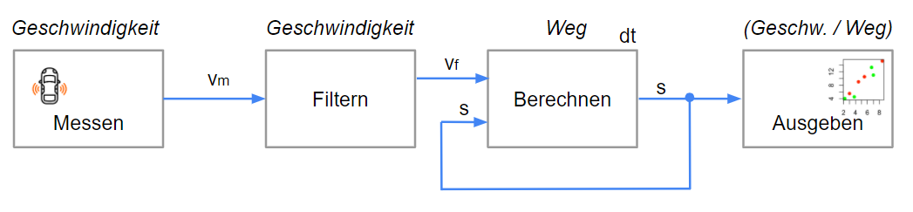
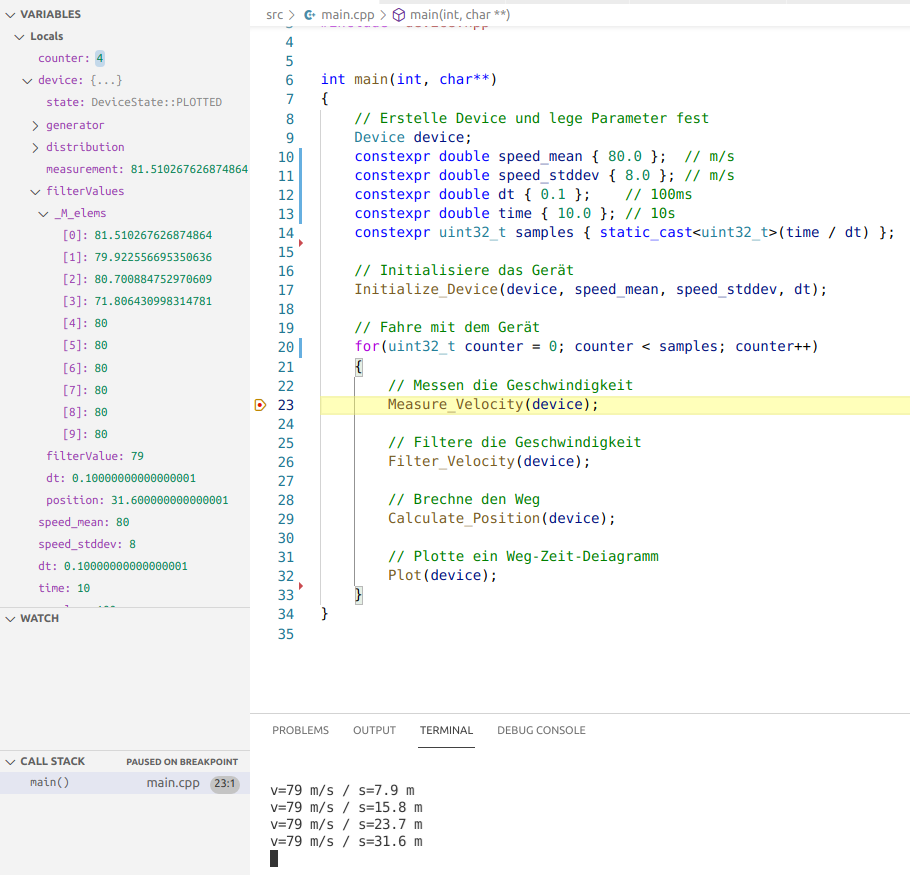

# Den Weg eines Fahrzeugs aus seiner Geschwindigkeit ermitteln

## 1. Blockschaltbild des Geräts

<br>

<!--  -->
  

<br>
<br>

## 2. Entwicklungsschritte

Entwicklungsschritte sind:
-	2.1. Formuliere die Idee mit einem Blockschaltbild (BSB)
-	2.2. Erstelle ein C++-Projekt in Visual Studio Code
-	2.3. Schreibe die einzelnen [Arbeitsschritte](#link3) des BSD auf
-   2.4. Deklariere die [Schnittstelle](#link4) und inkludiere sie
-   2.5. Definiere die [Funktionsrümpfe](#link5) und rufe die Schnittstelle auf
-   2.6. Definiere alle [Funktionen](#link6)
-   2.7. Definiere zu jeder Funktion ein Unit-Test
-	2.8. Dokumentation (Dateien und md-Datei) abschließen

<br>
<br>

### <span id="link3">2.3. Schreibe die einzelnen Arbeitsschritte des BSD auf</span>

Schreibe den Ablauf des Blockschaltbilds als Kommentar auf. Erweitere um Initialisierung und eine Schleife für die Zyklen.

<br>

Datei main.cpp:
```C++
// ....
int main(int, char**)
{
    // Erstelle Device und lege Parameter fest
    Device device;
    constexpr double dt { 0.1 };    // 100ms
    constexpr double time { 10.0 }; // 10s
    constexpr uint32_t samples { static_cast<uint32_t>(time / dt) };

    // Initialisiere das Gerät

    // Fahre mit dem Gerät
    for(uint32_t counter = 0; counter < samples; counter++)
    {
        // Messen die Geschwindigkeit

        // Filtere die Geschwindigkeit

        // Brechne den Weg

        // Plotte ein Weg-Zeit-Deiagramm
	}
}
// ...
```

<br>

### <span id="link4">2.4. Deklare die Schnittstelle und inkludiere sie</span>

<br>

Datei device.hpp:

```C++
// ...
using filter_array = std::array<double,10>;

enum struct DeviceState
{
    UNDEFINED,
    INITILIZED,
    MEASURED,
    FILTERED,
    CALCULATED,
    PLOTTED
};

struct Device
{
    DeviceState state { DeviceState::UNDEFINED };
};

// Initialisiere das Gerät
void Initialize_Device(Device&, double speed_mean, double speed_stddev, double dt);

// Messen die Geschwindigkeit
double Measure_Velocity(Device&);

// Filtere die Geschwindigkeit
double Filter_Velocity(Device&);

// Brechne den Weg
double Calculate_Position(Device&);

// Plotte ein Weg-Zeit-Deiagramm
void Plot(Device&);

// ....
```

<br>

### <span id="link5">2.5. Definiere die Funktionsrümpfe und rufe die Schnittstelle auf</span>

Die Zustände sind fürs Debuggen da, um den Kontrollfluss zu prüfen.

<br>

Datei device.cpp:

```C++
// ...
void Initialize_Device( Device& dev, double speed_mean, double speed_stddev, double dt)
{
    dev.state = DeviceState::INITILIZED;
}


double Measure_Velocity(Device& dev)
{
    dev.state = DeviceState::MEASURED;

    return 1.0;
}


double Filter_Velocity(Device& dev)
{
    dev.state = DeviceState::FILTERED;

    return 2.0;
}


double Calculate_Position(Device& dev)
{
    dev.state = DeviceState::CALCULATED;

    return 3.0;
}


void Plot(Device& dev)
{
    dev.state = DeviceState::PLOTTED;

}
// ....
```
<br>

Datei main.cpp:

```C++
// ....
int main(int, char**)
{
    // Erstelle Device und lege Parameter fest
    Device device;
	constexpr double speed_mean { 80.0 };  // m/s
    constexpr double speed_stddev { 8.0 }; // m/s
    constexpr double dt { 0.1 };    // 100ms
    constexpr double time { 10.0 }; // 10s
    constexpr uint32_t samples { static_cast<uint32_t>(time / dt) };

    // Initialisiere das Gerät
	Initialize_Device(device, speed_mean, speed_stddev, dt);

    // Fahre mit dem Gerät
    for(uint32_t counter = 0; counter < samples; counter++)
    {
        // Messen die Geschwindigkeit
		Measure_Velocity(device);

        // Filtere die Geschwindigkeit
		Filter_Velocity(device);

        // Brechne den Weg
		Calculate_Position(device);

        // Plotte ein Weg-Zeit-Deiagramm
		Plot(device);

        counter++;
}
// ...
```
<br>

### <span id="link6">2.6. Definiere alle Funktionen</span>

Die Implementierung soll in kompakter funktionsorientierter Form erfolgen, für Schleifen sind Funktionen zu wählen - siehe Beispiel.

<br>

Datei device.cpp:

```C++
// ...
double Filter_Velocity(Device& dev)
{
    dev.state = DeviceState::FILTERED;

    // Gleitender Mittelwertfilter
    std::rotate(dev.filterValues.rbegin(), dev.filterValues.rbegin() + 1, dev.filterValues.rend());
    dev.filterValues.at(0) = dev.measurement;
    dev.filterValue = std::accumulate(dev.filterValues.begin(), dev.filterValues.end(), 0) / dev.filterValues.size();

    return dev.filterValue;
}
// ...
```

<br>
<br>

## 3. Debuggen

<br>

Debuggen durh die Applikation:

<br>



<br>